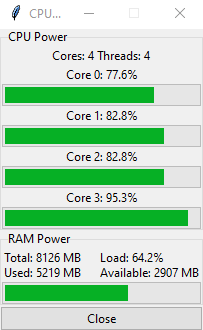

#ProcMon
A simple mini project showing the load of your processor and RAM.



##Requirements
- python 3.9+
- psutil 5.8.0

##Installation 
```
$ git clone https://github.com/gunSlaveUnit/ProcMon.git 
$ mkdir venv
$ python3 -m venv venv/
$ python —m pip install —upgrade pip
$ pip install -r requirements.txt
```
##Start
```
$ python main.py
```
